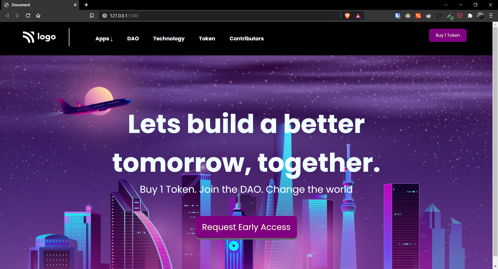

# Project-05 | Crypto Landing page

Hi there,
I'm Wasit Ali and this is my 5th project on HTML and CSS.

## 🖥 Preview

`note:` please make sure the preview screen is `1920 x 1080` and the site is desktop view only as of now.

🚀 [Live Preview](https://fastidious-travesseiro-828363.netlify.app/)

## 👀 What I have learned in this project?

- Flex-box for elements.
- Clear understanding of statis image property.
- Use of static background image in a scrolling web page.

## ⏲ Time taken to finish the project

- Almost 6 hours
